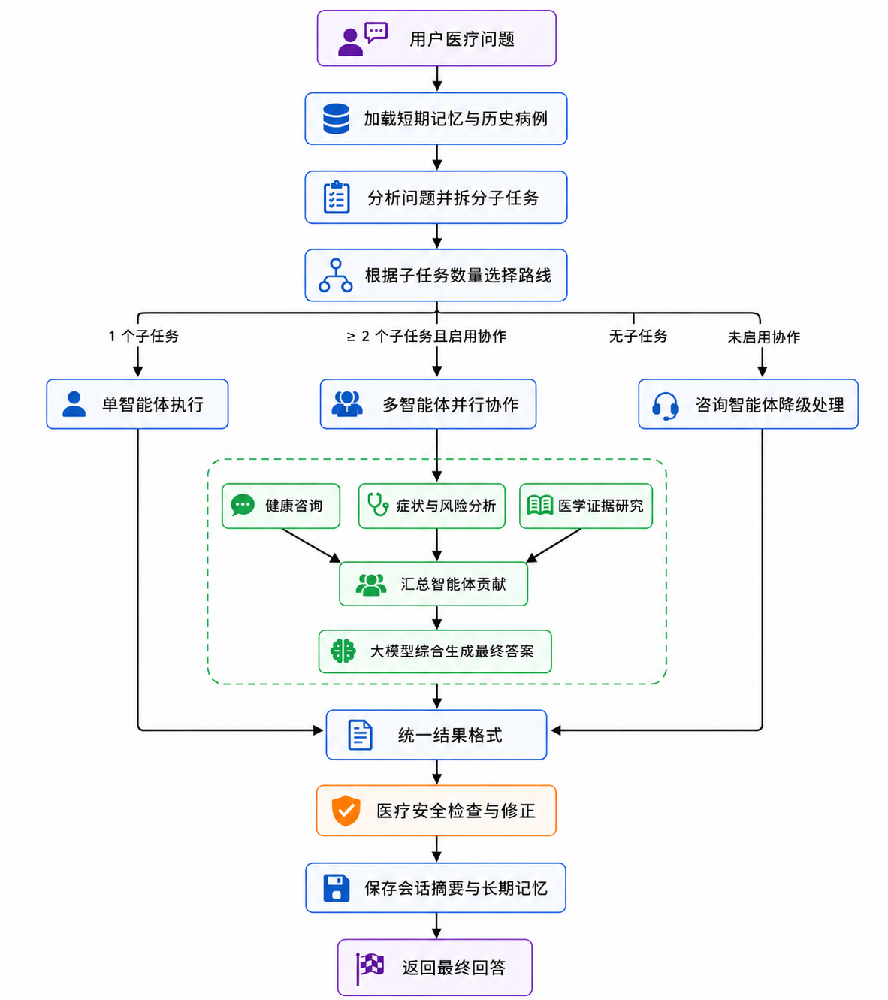

# Medical-Agent-Swarm

Medical-Agent-Swarm 是一个基于 LangGraph 和 OpenAI 兼容接口构建的多智能体医疗问答项目。

系统会根据问题组织健康咨询、症状分析和医学研究 Agent 协作，并通过医疗 Skill 完成问诊信息收集、风险评估、症状模式分析、生活方式建议和资料检索。回答生成后，系统还会执行安全检查并补充必要的就医提醒。

> 本项目处于研究原型阶段，仅用于学习、开发和技术验证，不能替代医生的诊断、处方或治疗。

## 功能

- 多智能体协作：根据问题复杂度组织不同 Agent 分工处理
- 医疗 Skill：通过可发现的 Skill 扩展医疗问答流程
- 风险识别：识别潜在高风险症状并给出就医紧迫性提示
- 证据研究：支持网络搜索与多来源信息综合
- 会话上下文：默认在内存中维护同一会话的对话历史
- 输出安全检查：检查危险建议、过度诊断和用药风险
- 多种使用方式：支持命令行、Python 调用和本地调试界面

## 工作流程



LangGraph 负责加载会话记忆、规划并路由任务、调度单 Agent 或多 Agent 协作，以及完成结果综合、安全检查和记忆保存。

当前内置的主要 Skill：

| Skill | 用途 |
| --- | --- |
| `collect-clinical-context` | 提取问诊信息、识别缺失信息并生成追问 |
| `assess-risk` | 评估症状风险等级和就医紧迫性 |
| `analyze-symptoms` | 分析症状模式和可能方向，不直接给出确诊 |
| `recommend-lifestyle` | 提供饮食、运动、睡眠等生活方式建议 |
| `deep-research` | 搜索医学资料并综合多来源证据 |

## 环境要求

- Python 3.10 或更高版本
- 一个兼容 OpenAI API 格式的模型服务
- Node.js 和 npm，仅在使用前端调试界面时需要

## 快速开始

### 1. 获取项目

```bash
git clone https://github.com/BlueX888/Medical-Agent-Swarm.git
cd Medical-Agent-Swarm
```

### 2. 创建虚拟环境

Windows PowerShell：

```powershell
python -m venv .venv
.\.venv\Scripts\Activate.ps1
```

Linux 或 macOS：

```bash
python3 -m venv .venv
source .venv/bin/activate
```

### 3. 安装依赖

```bash
python -m pip install --upgrade pip
pip install -r requirements.txt
```

### 4. 配置模型

复制配置模板：

Windows PowerShell：

```powershell
Copy-Item config.py.example config.py
```

Linux 或 macOS：

```bash
cp config.py.example config.py
```

编辑 `config.py`：

```python
LLM_CONFIG = {
    "api_key": "your-api-key",
    "model_name": "your-model",
    "base_url": "https://api.openai.com/v1",
    "temperature": 0.7,
    "max_tokens": 8192,
}
```

`config.py` 包含私密配置，已被 `.gitignore` 排除。请勿将真实 API Key 提交到 GitHub。

### 5. 启动命令行程序

```bash
python main.py
```

需要查看更详细的运行日志时：

```bash
python main.py --verbose
```

## 在 Python 中调用

```python
import asyncio

from swarm import process_with_swarm


async def main():
    result = await process_with_swarm(
        question="最近两天头痛并伴有恶心，需要马上就医吗？",
        context={"age": 30},
        session_id="example-session",
    )
    print(result["answer"])


asyncio.run(main())
```

可以通过相同的 `session_id` 保留当前进程内的会话上下文。默认短期记忆保存在内存中，程序退出后不会保留。

## 本地调试界面

调试界面是可选功能，不影响命令行方式使用。

先在项目根目录启动 FastAPI：

```bash
uvicorn api.server:app --reload --host 127.0.0.1 --port 8000
```

然后打开另一个终端启动前端：

```bash
cd frontend
npm install
npm run dev
```

浏览器访问 `http://127.0.0.1:5173`。前端默认连接 `http://127.0.0.1:8000`，也可以通过 `VITE_API_BASE_URL` 修改 API 地址。

API 启动后可访问：

- API 文档：`http://127.0.0.1:8000/docs`
- 健康检查：`http://127.0.0.1:8000/api/health`

## 可选长期记忆

长期记忆使用 Mem0，默认未安装且不会启用。启用时需要自行安装依赖：

```bash
pip install mem0ai
```

然后在 `config.py` 中配置：

```python
MEM0_CONFIG = {
    "api_key": "m0-your-mem0-key",
}
```

不配置 Mem0 时，核心问答和多 Agent 协作仍可正常运行。

## 项目结构

```text
Medical-Agent-Swarm/
|-- .claude/skills/    # 运行时发现和加载的医疗 Skill
|-- agents/            # 咨询、症状分析和研究 Agent
|-- api/               # 本地调试 API
|-- constraints/       # Agent 与 Swarm 约束规则
|-- core/              # LLM 客户端、Agent Loop 和安全检查
|-- frontend/          # React 调试界面
|-- memory/            # 短期与可选长期记忆
|-- research/          # 网络搜索和证据综合
|-- swarm/             # LangGraph 编排与公共调用入口
|-- validation/        # 输出修复工具
|-- config.py.example  # 配置模板
|-- main.py            # 命令行入口
`-- requirements.txt   # Python 依赖
```

`.claude/skills/` 虽然是隐藏目录，但包含系统运行时需要加载的 Skill，使用或分发项目时请保留该目录。

## 隐私与安全

- 不要在公开 Issue、日志或示例中提交真实患者信息
- 用户输入可能会发送到所配置的模型服务
- 深度研究功能可能会向外部搜索服务发送查询内容
- 启用 Mem0 后，会话摘要可能被发送到对应的云服务
- 部署为公开服务前，应自行增加身份验证、访问控制、限流、审计和数据脱敏
- 不建议直接将当前调试 API 暴露到公网

## 医疗免责声明

本项目输出仅供学习和一般信息参考，不构成医疗诊断、处方或治疗建议，也不能替代专业医务人员。

如出现呼吸困难、意识障碍、胸痛、严重过敏、持续大量出血、突发肢体无力等紧急症状，请立即联系当地急救服务或前往急诊。

使用者应自行评估模型、数据来源和部署方式的可靠性，并对实际使用结果负责。

## License

本项目采用 [MIT License](LICENSE)。
