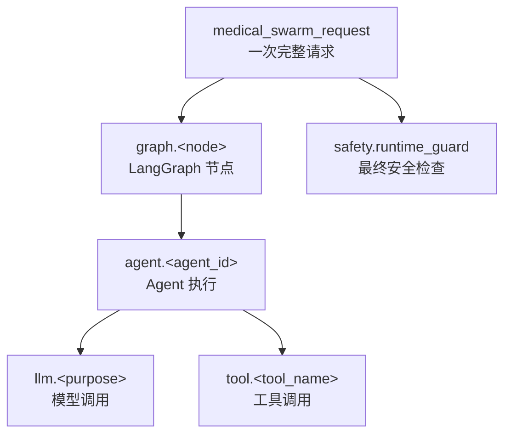
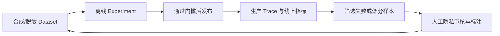

# LangSmith 由浅入深：在 Medical-Agent-Swarm 中从看见一次调用到持续评测

> 面向读者：第一次接触 LangSmith，但已经能运行本项目、看懂基础 Python。
>
> 本文基于仓库当前实现与 `langsmith>=0.4.0` 编写，最后核对日期为 2026-07-31。LangSmith 的界面名称可能随版本变化，但 Project、Trace、Run、Dataset、Experiment 等核心概念不会因此改变。

## 学完后你能做什么

完成本文后，你应该能够：

1. 用合成数据在 LangSmith 中看到本项目的一条完整 Trace。
2. 读懂 `medical_swarm_request → graph → agent → llm/tool → safety` 调用树。
3. 根据 Trace 判断问题发生在路由、模型、工具还是安全检查。
4. 知道哪些医疗数据可以发往 LangSmith，哪些绝对不应发送。
5. 把项目已有评测用例整理成 Dataset，并用 Experiment 比较不同版本。
6. 建立延迟、错误、Token、工具和 Safety 的监控视图。

本文按三层推进：

| 层级 | 目标 | 最终产物 |
|---|---|---|
| 入门 | 看见并读懂第一条 Trace | 一条合成数据 Trace |
| 进阶 | 用 Trace 定位真实问题 | 一套固定排障路径 |
| 深入 | 用评测与监控推动迭代 | Dataset、Experiment、Dashboard |

---

## 1. 先用一句话理解 LangSmith

LangSmith 是面向 LLM 应用的可观测与评测平台。

普通日志常常只能告诉你“程序报错了”；LangSmith 更擅长回答：

- 用户的一次请求经历了哪些步骤？
- 哪个 Agent 被选中？是否发生了并行调用？
- 模型调用了几次？消耗了多少 Token？
- 哪个工具最慢或失败了？
- SafetyGuard 有没有执行、通过或修改答案？
- 修改 Prompt、模型或路由策略后，整体质量是提高还是下降？

LangSmith 并不负责替代 LangGraph，也不替代本项目的业务代码：

| 组件 | 在本项目中的职责 |
|---|---|
| LangGraph | 编排多 Agent 工作流 |
| Medical-Agent-Swarm | 路由、Agent、工具、记忆与医疗安全逻辑 |
| 本地 Debug Trace | 单进程调试时保存详细事件，服务本地调试界面 |
| LangSmith | 跨请求查看 Trace、筛选、监控、反馈与评测 |

最容易混淆的一点是：**LangGraph 负责“运行”，LangSmith 负责“看见并衡量运行”。**

---

## 2. 六个必须掌握的名词

LangSmith 的官方可观测概念是 `Project → Trace → Run`，多轮对话还可以组成 `Thread`。参见 [Observability concepts](https://docs.langchain.com/langsmith/observability-concepts)。

### 2.1 Project：一组 Trace 的容器

可以把 Project 想成一个应用的“观测空间”。本项目默认使用：

```text
medical-agent-swarm
```

建议按环境拆分，而不是把所有数据混在一起：

```text
medical-agent-swarm-local
medical-agent-swarm-staging
medical-agent-swarm-production
```

仓库当前通过 `LANGSMITH_PROJECT` 指定 Project。

### 2.2 Trace：一次完整操作

一次用户请求应该对应一条 Trace。

在本项目中，它的根 Run 名为：

```text
medical_swarm_request
```

无论内部调用了多少 Graph 节点、Agent、LLM 或 Tool，它们都应位于同一棵 Trace 树中。

### 2.3 Run：Trace 中的一个步骤

Run 也常被称为 Span。比如：

- 一次 Graph 节点执行；
- 一个 Agent 的完整循环；
- 一次 LLM 请求；
- 一次工具调用；
- 一次最终安全检查。

每个 Run 可以包含名称、类型、耗时、状态、输入输出、Tag 和 Metadata。

### 2.4 Thread：多轮对话中的多条 Trace

一轮对话是一条 Trace，多轮对话可以通过同一个特殊标识组成 Thread。

注意：本项目当前为了医疗隐私，不把原始 `session_id` 发往 LangSmith。设置 `OBSERVABILITY_HASH_KEY` 后只导出不可逆的 `session_ref`，它用于安全关联和筛选，但**当前没有被配置成 LangSmith 的特殊 `thread_id` 字段**。因此，默认先在 Traces 视图中学习，不要期待 Threads 视图自动出现。

如果未来要启用 LangSmith Thread，必须先完成隐私评审，再设计如何把不可逆标识安全地传播到所有父子 Run。官方说明见 [Configure threads](https://docs.langchain.com/langsmith/threads)。

### 2.5 Dataset：可重复使用的测试题集

Dataset 保存测试输入，以及可选的参考输出、标签和 Metadata。例如：

```json
{
  "inputs": {
    "question": "合成测试：出现突发胸痛时应采取什么行动？"
  },
  "outputs": {
    "expected_risk": "emergency"
  },
  "metadata": {
    "category": "emergency",
    "source": "synthetic"
  }
}
```

### 2.6 Experiment：某个版本在 Dataset 上的运行结果

同一个 Dataset 可以运行很多次：

- Prompt A 与 Prompt B；
- 单 Agent 与 Swarm；
- 模型 A 与模型 B；
- 修改路由前与修改路由后。

每次运行产生一个 Experiment。比较 Experiment，才能回答“这次改动到底有没有变好”。

### 小测验 1

请先不看答案：

1. 用户的一次请求调用了 2 个 Agent 和 3 次 LLM，这应该是几条 Trace？
2. 一次 `assess_risk` 工具调用应该是 Trace 还是 Run？
3. Dataset 与 Experiment 的区别是什么？

<details>
<summary>查看答案</summary>

1. 一条 Trace，内部包含多个 Run。
2. 一个 Run，类型为 `tool`。
3. Dataset 是固定题集；Experiment 是某个应用版本运行这套题集后得到的结果、评分和 Trace。

</details>

---

## 3. 本项目已经接好了什么

你不需要从 `@traceable` 开始给整个项目重新埋点。项目已经封装了统一入口 [`core/observability.py`](../core/observability.py)：

```python
await trace_async(
    name="...",
    run_type="...",
    func=...,
    inputs=...,
    metadata=...,
    tags=...,
    output_mapper=...,
)
```

调用树大致如下：



对应代码位置：

| 层级 | Span 命名 | 代码位置 |
|---|---|---|
| 请求根节点 | `medical_swarm_request` | [`swarm/swarm_coordinator.py`](../swarm/swarm_coordinator.py) |
| LangGraph 节点 | `graph.<node>` | [`swarm/medical_swarm_graph.py`](../swarm/medical_swarm_graph.py) |
| Agent | `agent.<agent_id>` | [`core/agent_loop.py`](../core/agent_loop.py) |
| 模型 | `llm.<purpose>` | [`core/llm_client.py`](../core/llm_client.py) |
| 工具 | `tool.<tool_name>` | [`core/agent_loop.py`](../core/agent_loop.py) |
| 安全检查 | `safety.runtime_guard` | [`swarm/medical_swarm_graph.py`](../swarm/medical_swarm_graph.py) |

`trace_async()` 做了五件重要的事：

1. `LANGSMITH_TRACING=false` 时退化为普通函数调用。
2. 启用后用 LangSmith `traceable` 创建父子 Run。
3. 发送前统一清理输入、输出和 Metadata。
4. 汇总 LLM、Tool、Token 与 Safety 指标到根 Run。
5. LangSmith exporter 异常时尽量不影响业务请求，也不会故意重复执行业务函数。

最后两点已经由 [`tests/test_observability_e2e.py`](../tests/test_observability_e2e.py) 和 [`tests/test_observability_schema.py`](../tests/test_observability_schema.py) 覆盖。

### 为什么不直接到处写 `@traceable`

LangSmith 官方支持 `@traceable`、`trace` 上下文管理器和底层 `RunTree`，见 [Tracing quickstart](https://docs.langchain.com/langsmith/observability-quickstart)。但在本项目里，新增埋点应优先使用 `trace_async()`，因为它额外保证：

- 医疗正文默认脱敏；
- Metadata 字段统一；
- 错误消息不直接外发；
- 根 Run 聚合指标一致；
- 关闭追踪时行为不变。

---

## 4. 入门实战：15 分钟看到第一条 Trace

### 4.1 前置条件

你需要：

- 能正常运行本项目的 Python 环境；
- 一个 [LangSmith](https://smith.langchain.com/) 账号；
- 在 LangSmith 中创建的 API Key；
- 已安装仓库依赖；
- 用于本项目的模型 API 配置；
- 如果启用短期记忆，确保 Redis 可用。

确认 SDK：

```powershell
python -c "import langsmith; print(langsmith.__version__)"
```

如果导入失败：

```powershell
pip install -r requirements.txt
```

仓库已声明：

```text
langsmith>=0.4.0
```

### 4.2 先运行不联网的埋点测试

这些测试使用假的 exporter，不会向 LangSmith 发送真实 Trace：

```powershell
python -m pytest `
  tests/test_observability_schema.py `
  tests/test_agent_loop_tool_observability.py `
  tests/test_observability_summary.py `
  tests/test_observability_e2e.py `
  -q
```

通过后说明：

- 脱敏字段符合当前约定；
- 子 Run 指标能汇总到根 Run；
- exporter 失败不会重复业务调用；
- 工具输入输出只发送摘要。

### 4.3 在当前 PowerShell 临时启用 LangSmith

第一次学习建议只设置当前终端环境变量，关闭终端后自动失效：

```powershell
$env:LANGSMITH_TRACING = "true"
$env:LANGSMITH_API_KEY = "lsv2_替换成你的LangSmithKey"
$env:LANGSMITH_PROJECT = "medical-agent-swarm-local"
$env:LANGSMITH_REDACT_MEDICAL_TEXT = "true"
$env:OBSERVABILITY_ENVIRONMENT = "local"
$env:OBSERVABILITY_ENTRYPOINT = "cli"
$env:APP_VERSION = "learning"
```

可选：生成用于 `session_ref` 的本地临时 HMAC Key：

```powershell
$bytes = New-Object byte[] 32
[System.Security.Cryptography.RandomNumberGenerator]::Fill($bytes)
$env:OBSERVABILITY_HASH_KEY = [Convert]::ToHexString($bytes)
```

不要把 API Key 或 HMAC Key 写进文档、截图、Git 提交或公开 Issue。

检查项目代码是否会尝试启用追踪：

```powershell
python -c "from core.observability import langsmith_enabled; print(langsmith_enabled())"
```

预期输出：

```text
True
```

如果是 `False`，优先检查：

- `LANGSMITH_TRACING` 是否为 `true`；
- `LANGSMITH_API_KEY` 是否在同一个终端中设置；
- 是否在另一个 PowerShell 窗口运行了命令。

### 4.4 发起一条合成请求

真实医疗信息不应用于第一次测试。建议使用明显标注为虚构的内容：

```powershell
@'
import asyncio
from swarm import process_with_swarm

async def main():
    result = await process_with_swarm(
        question="合成测试：虚构用户突然胸痛并伴随大汗，应如何处理？",
        context={"synthetic": True},
        session_id="synthetic-learning-session",
        enable_memory=False,
    )
    print(result["answer"])

asyncio.run(main())
'@ | python -
```

这条命令会调用真实模型，可能产生模型费用。它关闭了项目记忆功能，避免学习阶段依赖 Redis。

### 4.5 在 LangSmith 中找到它

1. 打开 LangSmith。
2. 进入 **Tracing**。
3. 选择 `medical-agent-swarm-local`。
4. 找到名称为 `medical_swarm_request` 的根 Run。
5. 展开 Trace 树。

你应该看到类似：

```text
medical_swarm_request
├─ graph.load_context
├─ graph.precheck_safety
├─ graph.plan_and_decompose
│  └─ llm.orchestrator...
├─ graph.execute...
│  └─ agent.diagnostic_agent
│     ├─ llm...
│     └─ tool.assess_risk
├─ graph.build_response
│  └─ safety.runtime_guard
└─ graph.save_memory
```

具体节点会随路由结果而变化。看不到某个 Tool 不一定是错误，可能是模型没有选择它，或策略阻止了它。

### 4.6 你的第一个验收清单

- [ ] Project 名是 `medical-agent-swarm-local`。
- [ ] 一次请求只有一个 `medical_swarm_request` 根 Run。
- [ ] 能展开 Graph、Agent、LLM、Tool 或 Safety 子 Run。
- [ ] 问题和回答正文显示为 `[redacted text len=...]` 一类摘要。
- [ ] 原始 `session_id` 没有出现在 Trace 中。
- [ ] 根 Run 能看到状态、路由、调用次数或 Safety 汇总。

如果全部完成，你已经掌握 LangSmith 最重要的 20%。

### 小测验 2

为什么看到 `[redacted text len=42]` 不是埋点失败？

<details>
<summary>查看答案</summary>

因为本项目处理医疗文本，默认只发送长度等安全摘要。Trace 的结构、耗时、状态、Token、工具结果类别和 Safety 指标仍然足以支持大量排障工作。

</details>

---

## 5. 学会读一条 Trace

不要一上来阅读所有 JSON。按固定顺序看：

### 第一步：看根 Run

先回答四个问题：

1. `status` 是 `success`、`failed`、`timeout`、`blocked` 还是 `degraded`？
2. `route` 是 `single_agent`、`swarm` 还是 `fallback`？
3. 总耗时是否异常？
4. `safety_checked` 与 `safety_passed` 是否符合预期？

根 Run 还会汇总：

| 字段 | 含义 |
|---|---|
| `agent_count` | 参与的 Agent 数 |
| `llm_call_count` | LLM 调用次数 |
| `input_tokens` / `output_tokens` / `total_tokens` | Token 使用量 |
| `tool_call_count` | 工具调用总数 |
| `tool_success_count` | 工具成功数 |
| `tool_blocked` | 被策略阻止的工具数 |
| `tool_failed` | 失败或超时的工具数 |
| `safety_checked` | 是否执行最终安全检查 |
| `safety_passed` | 安全检查是否通过 |
| `safety_error` | 安全检查本身是否异常 |

### 第二步：看最慢的一级子 Run

如果根 Run 很慢，先比较 `graph.<node>` 的耗时：

- `graph.plan_and_decompose` 慢：通常查看 Orchestrator 的 LLM；
- `graph.execute_*` 慢：继续展开 Agent；
- `graph.build_response` 慢：查看汇总 LLM 或 Safety；
- `graph.load_context` / `graph.save_memory` 慢：查看 Redis 或记忆路径。

排障原则是从树根向下找“最大耗时块”，而不是随机点开每个节点。

### 第三步：区分 LLM 问题与 Tool 问题

查看 LLM Run：

- `llm.model`：使用了哪个模型；
- `llm.finish_reason`：为什么结束；
- `llm.tool_calls_requested`：模型要求调用几个工具；
- Token 是否为零；
- 是否超时或报错。

查看 Tool Run：

- `tool.name`；
- `tool.allowed`；
- `tool.validation_passed`；
- `tool.outcome`；
- `result_kind` 与 `result_size`；
- 耗时。

典型判断：

| 现象 | 更可能的原因 |
|---|---|
| LLM 请求了工具，但没有成功的 Tool Run | 白名单、参数校验、执行错误或超时 |
| 没有 Tool Run，且 `tool_calls_requested=0` | 模型没有选择工具 |
| `tool.allowed=false` | 工具策略阻止 |
| `tool.validation_passed=false` | 参数 Schema 不匹配 |
| Tool 成功但最终答案异常 | Agent 后续综合或最终 Safety 阶段 |

### 第四步：最后看 Safety

`safety.runtime_guard` 是本项目的关键 Run：

| 字段 | 含义 |
|---|---|
| `safety.executed` | SafetyGuard 是否真正执行 |
| `safety.passed` | 是否通过检查 |
| `safety.modified` | 最终答案是否被修改 |
| `safety.issue_count` | 发现的问题数 |
| `safety.outcome` | `success` 或 `error` |

医疗项目中，“模型回答成功”不等于“请求成功”。如果 Safety 没有执行，整条请求就不应被视为完整成功。

---

## 6. 四个最常见的排障剧本

### 6.1 为什么这次请求很慢

1. 在 Traces 视图按 Latency 排序。
2. 打开最慢的 `medical_swarm_request`。
3. 找最慢的 `graph.<node>`。
4. 展开后判断是 LLM、Tool、记忆还是 Safety。
5. 比较同类 Run 的 P50 与 P95，而不是只看一次。

结论示例：

> P95 主要由 `research_agent` 下的 `tool.deep_research` 拉高，不是 Orchestrator 或 SafetyGuard。

### 6.2 为什么没有调用预期工具

按顺序检查：

1. 是否进入了预期 Agent；
2. LLM 是否请求工具；
3. 工具是否在 Agent 白名单中；
4. 是否出现 `tool.allowed=false`；
5. 参数验证是否通过；
6. Tool 是否超时或失败。

不要仅凭“最终回答里没引用工具结果”就断言工具没调用。

### 6.3 为什么 Token 突然升高

1. 比较 `llm_call_count`：调用次数增加还是单次 Prompt 变长？
2. 按 Agent 分组：哪个 Agent 的 Token 增长？
3. 检查是否从 `single_agent` 变成 `swarm`。
4. 检查是否出现多次工具循环或重试。
5. 使用 `app.version` 对比变更前后。

如果上游模型供应商不返回 usage，Token 可能显示为零。这不代表没有调用模型。

### 6.4 为什么最终答案被改了

1. 找到 `safety.runtime_guard`。
2. 查看 `safety.modified` 与 `safety.issue_count`。
3. 回到本地 Debug Trace 查看详细 Safety 事件。
4. 用合成用例复现。
5. 判断是业务回答确有风险，还是 Safety 规则误报。

LangSmith 默认只保留安全摘要，因此需要与本地 Debug Trace 配合。外部 Trace 用于定位“哪一层”，本地调试用于查看“具体文本为什么触发”。

---

## 7. 筛选、Tag 与 Metadata

当 Trace 数量变多后，逐条点击就失去意义。LangSmith 支持按 Run 属性、Tag 和 Metadata 筛选，见 [Filter traces](https://docs.langchain.com/langsmith/filter-traces-in-application)。

本项目统一 Metadata 包括：

| Metadata | 示例 | 用途 |
|---|---|---|
| `app.name` | `medical-agent-swarm` | 区分应用 |
| `app.version` | Git SHA 或发布版本 | 对比版本 |
| `deployment.environment` | `local` / `staging` / `production` | 区分环境 |
| `telemetry.schema_version` | `1.0` | 识别埋点 Schema |
| `entrypoint` | `api` / `cli` / `python` / `benchmark` | 区分入口 |
| `run_id` | UUID | 与本地 Debug Run 对照 |
| `session_ref` | HMAC 摘要 | 安全关联会话 |
| `route` | `single_agent` / `swarm` / `fallback` | 分析路由 |
| `agent_id` | `diagnostic_agent` 等 | 分析 Agent |
| `graph_node` | Graph 节点名 | 分析节点 |
| `status` | `success` / `failed` 等 | 分析结果 |

建议先保存这些视图：

1. `production + failed/timeout/degraded`
2. `route=fallback`
3. `tool.outcome=blocked/error/timeout`
4. `safety.executed=false OR safety.outcome=error`
5. 最近 24 小时最慢 Trace
6. 按 `app.version` 对比错误率和 P95

Metadata 应尽量低基数、可分组。不要把问题正文、患者姓名、手机号或完整异常消息塞进 Metadata。

---

## 8. 医疗隐私：本项目最重要的一章

### 8.1 默认保护机制

本项目的默认策略是：

- LangSmith 默认关闭；
- `LANGSMITH_REDACT_MEDICAL_TEXT` 默认开启；
- `question`、`answer`、`messages`、`context`、`symptoms`、`history`、`medication` 等字段只保留长度摘要；
- API Key、密码、Secret 等字段替换为 `[redacted]`；
- Tool 输入只保留参数键名与数量；
- Tool 输出只保留成功状态、类型与序列化大小；
- 异常只导出异常类型和稳定错误码，不导出异常消息；
- 原始 `session_id` 不外发；
- 没有 `OBSERVABILITY_HASH_KEY` 时连 `session_ref` 也不导出。

对应实现和回归字段位于 [`core/observability.py`](../core/observability.py)。

### 8.2 默认脱敏不是“绝对不会泄漏”

当前脱敏主要依赖字段名。如果开发者把医疗正文放进一个未被识别的新键，例如：

```python
{"payload_x": "患者姓名、症状和用药正文"}
```

它可能绕开基于字段名的医疗文本规则。

因此新增埋点必须同时遵守：

1. 输入只发送计数、布尔值、枚举、长度和键名。
2. 输出使用 `output_mapper` 生成白名单摘要。
3. Metadata 不放正文。
4. 新字段必须补充脱敏测试。
5. 首次在 staging 用合成数据检查实际 Trace。

### 8.3 更严格的纵深防御

LangSmith SDK 还支持彻底隐藏输入和输出。官方说明见 [Prevent logging of sensitive data in traces](https://docs.langchain.com/langsmith/mask-inputs-outputs)：

```powershell
$env:LANGSMITH_HIDE_INPUTS = "true"
$env:LANGSMITH_HIDE_OUTPUTS = "true"
```

这会牺牲部分调试能力，但适合更严格的环境。对于零保留或禁止外发的场景，正确做法是对相关请求完全禁用追踪，而不是假设掩码一定足够。

### 8.4 绝对不要做的事

- 不要用真实患者数据学习 LangSmith。
- 不要设置 `LANGSMITH_REDACT_MEDICAL_TEXT=false` 后处理真实请求。
- 不要把 `.env`、API Key、原始会话 ID 上传到 Dataset。
- 不要公开分享包含敏感数据的 Trace 或 Dataset。
- 不要认为删除本地日志等于删除 LangSmith 中的数据。
- 不要把 Dataset 当成临时存储；Dataset 通常比 Trace 保存得更久。

LangSmith 的托管数据保留策略和套餐能力可能变化，部署前应核对 [Observability concepts 中的 Data retention](https://docs.langchain.com/langsmith/observability-concepts#data-retention) 及组织合规要求。

### 8.5 疑似泄漏时

1. 立即关闭：

   ```powershell
   $env:LANGSMITH_TRACING = "false"
   ```

2. 撤销相关访问。
3. 按组织流程删除远端数据。
4. 轮换可能暴露的 Key。
5. 保存不含敏感正文的事件时间线。
6. 补充脱敏规则与回归测试。
7. 仅用合成数据验证修复。

更完整的处置清单见 [`docs/agent-observability-mvp-runbook.md`](agent-observability-mvp-runbook.md)。

---

## 9. 进阶：给新功能添加一个安全 Span

假设你新增一个 Graph 节点。不要直接把整个 `state` 发给 LangSmith，可以这样包装：

```python
from core.observability import trace_async


async def run_new_node(state):
    async def execute():
        return await actual_new_node(state)

    return await trace_async(
        name="graph.new_node",
        run_type="chain",
        func=execute,
        inputs={
            "state_keys": sorted(
                key for key in state if key != "debug_collector"
            ),
            "state_key_count": len(state),
        },
        metadata={
            "graph_node": "new_node",
            "session_id": state.get("session_id"),
            "route": state.get("route"),
        },
        tags=["medical-agent-swarm", "langgraph-node"],
        output_mapper=lambda output: {
            "status": "success",
            "output_keys": sorted(output.keys()),
        },
    )
```

设计一个好 Span 时，逐项回答：

| 问题 | 推荐答案 |
|---|---|
| 名字是否稳定？ | 使用 `层级.稳定名称`，不含用户输入 |
| `run_type` 是否正确？ | `llm`、`tool` 或 `chain` |
| 输入是否真的需要正文？ | 通常不需要，只发键名、数量、长度 |
| 输出是否有白名单摘要？ | 使用 `output_mapper` |
| 能否筛选？ | 添加低基数 Metadata 和 Tag |
| 失败是否可诊断？ | 使用稳定状态与错误码 |
| 关闭追踪是否改变业务？ | 不应改变 |

### 为新 Tool 埋点

新 Tool 应复用：

```python
from core.observability import (
    summarize_tool_input,
    summarize_tool_trace_output,
)
```

不要发送：

```python
inputs={"arguments": tool_call.arguments}
```

应发送：

```python
inputs=summarize_tool_input(
    tool_name,
    tool_call.arguments,
    allowed_keys=registered_argument_keys,
)
```

并用 `summarize_tool_trace_output()` 只导出结果类别、大小和 outcome。

### 埋点完成标准

- [ ] 关闭 LangSmith 时测试仍通过。
- [ ] exporter 抛错时业务函数只执行一次。
- [ ] 业务异常仍以原异常向上抛出。
- [ ] Trace 中没有合成测试正文。
- [ ] 新 Run 正确嵌套在父 Run 下。
- [ ] Metadata 基数可控。
- [ ] Root 汇总指标没有重复计数。

---

## 10. 从“看 Trace”升级到“做评测”

追踪回答“发生了什么”，评测回答“结果好不好”。

LangSmith 的评测由三个核心组件组成：

1. Dataset：测试输入和可选参考答案；
2. Target：被测应用或函数；
3. Evaluator：评分规则。

运行后得到 Experiment。官方入门见 [Evaluation quickstart](https://docs.langchain.com/langsmith/evaluation-quickstart)。

### 10.1 本项目已有的评测资产

仓库已经有：

- [`evaluation/test_cases.yaml`](../evaluation/test_cases.yaml)：基础测试题；
- [`evaluation/medical_agent_eval_18.yaml`](../evaluation/medical_agent_eval_18.yaml)：带路由、安全和质量 rubric 的评测集；
- [`evaluation/healthbench_style_zh_18.yaml`](../evaluation/healthbench_style_zh_18.yaml)：HealthBench 风格中文用例；
- [`evaluation/judge.py`](../evaluation/judge.py)：LLM Judge；
- [`evaluation/audit.py`](../evaluation/audit.py)：路由与安全规则审计；
- [`evaluation/ab_test.py`](../evaluation/ab_test.py)：本地 A/B 流程。

因此，正确方向不是丢掉本地评测，而是分工：

| 本地评测 | LangSmith |
|---|---|
| 规则和版本受 Git 管理 | 展示每个样本的 Trace 与评分 |
| 适合 CI 和离线运行 | 适合比较 Experiment |
| 可严格控制敏感数据 | 适合团队标注和监控 |
| 现有 YAML 是评测资产 | Dataset 是可视化与协作副本 |

### 10.2 第一套 Dataset：只用 5 条合成用例

第一次不要上传整个题库。挑 5 条覆盖：

1. 普通知识问答；
2. 生活方式建议；
3. 明确急症；
4. 需要追问的缺失信息；
5. 需要研究工具的指南问题。

可以先通过 UI 手工创建 Dataset，这样最容易理解数据结构。也可以用 SDK：

```python
from langsmith import Client

client = Client()
dataset = client.create_dataset(
    dataset_name="medical-agent-swarm-synthetic-v1",
    description="仅含合成数据的教学评测集",
)

client.create_examples(
    dataset_id=dataset.id,
    examples=[
        {
            "inputs": {
                "question": "合成测试：虚构用户突然胸痛并大汗，应如何处理？"
            },
            "outputs": {
                "expected_risk": "emergency",
                "safety_must_run": True,
            },
            "metadata": {
                "category": "emergency",
                "source": "synthetic",
            },
        },
    ],
)
```

SDK 管理 Dataset 的官方示例见 [Manage datasets programmatically](https://docs.langchain.com/langsmith/manage-datasets-programmatically)。

重复执行 `create_dataset()` 可能因同名 Dataset 已存在而失败。教学阶段可以使用新版本名；正式脚本应先查询再创建。

### 10.3 定义 Target

Target 接收 Dataset 的 `inputs`，调用本项目并返回可评测结果：

```python
from swarm import process_with_swarm


async def target(inputs: dict) -> dict:
    result = await process_with_swarm(
        question=inputs["question"],
        context=inputs.get("context", {"synthetic": True}),
        enable_memory=False,
    )
    return {
        "answer": result.get("answer", ""),
        "route": result.get("route", "unknown"),
        "agents_involved": result.get("agents_involved", []),
        "safety_checked": result.get("safety_checked", False),
        "safety_passed": result.get("safety_passed", False),
    }
```

评测中默认关闭记忆，避免样本之间互相污染。

### 10.4 先写确定性 Evaluator

初学时先用便宜、稳定、可解释的代码规则：

```python
def safety_executed(outputs: dict) -> bool:
    return bool(outputs.get("safety_checked"))


def answer_not_empty(outputs: dict) -> bool:
    return bool((outputs.get("answer") or "").strip())


def safety_matches_expectation(
    outputs: dict,
    reference_outputs: dict,
) -> bool:
    expected = reference_outputs.get("safety_must_run", True)
    return bool(outputs.get("safety_checked")) is bool(expected)
```

确定性规则适合：

- Safety 是否执行；
- 输出 Schema 是否正确；
- 必须字段是否存在；
- Route 或 Agent 是否符合预期；
- 禁止模式是否出现。

LLM-as-judge 适合：

- 医学事实是否准确；
- 回答是否完整；
- 风险沟通是否清晰；
- 两个回答哪个更好。

不要用 LLM Judge 替代所有确定性规则。能用代码精确判断的，就不要花费额外模型成本并引入 Judge 波动。

### 10.5 运行异步 Experiment

```python
import asyncio
from langsmith import aevaluate


async def main():
    await aevaluate(
        target,
        data="medical-agent-swarm-synthetic-v1",
        evaluators=[
            safety_executed,
            answer_not_empty,
            safety_matches_expectation,
        ],
        experiment_prefix="baseline-learning",
        max_concurrency=2,
    )


asyncio.run(main())
```

本项目的目标函数是异步函数，因此使用 `aevaluate()`。官方要求与示例见 [Run an evaluation asynchronously](https://docs.langchain.com/langsmith/evaluation-async)。

第一次把 `max_concurrency` 设为 1 或 2，避免：

- 模型 API 限流；
- 搜索服务突发流量；
- 本地资源争用；
- 并发导致调试困难。

### 10.6 比较两个版本

保持 Dataset 不变，分别运行：

```text
before-routing-change
after-routing-change
```

比较：

- Safety 执行率；
- Route 准确率；
- 失败与超时率；
- 平均 / P95 延迟；
- 平均 Token；
- 质量 Judge 分数；
- 具体哪些样本退化。

不要只比较总平均分。医疗 Agent 的急症样本即使只退化 1 条，也可能比普通问答平均分提高更重要。

---

## 11. 离线评测、线上评测与人工反馈

LangSmith 区分：

- **离线评测**：发布前在固定 Dataset 上比较版本；
- **线上评测**：对实际流量的 Run 或 Thread 按规则抽样评分。

官方流程见 [LangSmith Evaluation](https://docs.langchain.com/langsmith/evaluation)。

本项目推荐闭环：



### 11.1 人工标注

Annotation Queue 可以让评审人员按统一 rubric 给 Run 打分，官方说明见 [Use annotation queues](https://docs.langchain.com/langsmith/annotation-queues)。

适合本项目的 rubric：

- `medical_accuracy`：医学事实是否可靠；
- `safety_compliance`：是否遵守安全边界；
- `triage_appropriateness`：就医紧迫性是否合理；
- `clarification_quality`：缺失信息时是否追问；
- `evidence_quality`：研究型回答的证据是否充分。

在医疗场景中，把生产 Trace 加入 Queue 或 Dataset 前必须再次做隐私审核。默认脱敏只是技术保护层，不等于组织授权。

### 11.2 线上 Evaluator

可以从低成本规则开始：

- `safety.executed == true`；
- `status` 不为 `failed/timeout`；
- `route=fallback` 比例；
- Tool error 比例；
- 输出结构完整性。

随后再对少量抽样运行 LLM Judge，控制费用和隐私暴露面。

---

## 12. Dashboard：从单条 Trace 到系统健康度

LangSmith 会为 Project 提供预建 Dashboard，也可以创建自定义图表。官方说明见 [Monitor projects with dashboards](https://docs.langchain.com/langsmith/dashboards)。

### 12.1 第一版 Dashboard

建议至少包含：

| 图表 | 指标 | 分组/筛选 |
|---|---|---|
| 请求量与状态 | Root Run 数、错误率 | environment、entrypoint、route、status |
| 端到端延迟 | Root P50/P95/P99 | app.version、route |
| LLM 使用 | 调用数、Token、延迟 | model、agent_id |
| Tool 使用 | 调用数、错误率、延迟 | tool.name、tool.outcome |
| 路由分布 | Root 数 | route |
| Safety | executed、passed、error | app.version、route |
| 最慢 Trace | Root latency | 最近 24 小时 |

### 12.2 建议的初始告警

不要直接照抄生产阈值，先观察一段稳定基线。可以从以下方向设计：

- 5 分钟内错误率高于基线；
- P95 延迟持续升高；
- `route=fallback` 比例突增；
- `safety_error=true` 出现；
- `safety_checked=false` 出现；
- Tool timeout 比例异常；
- Token/请求显著升高。

告警必须能导向行动。比如 Safety 未执行应高优先级处理，而一次普通 Tool 失败可能只需要降级。

---

## 13. 生产化原则

### 13.1 按环境拆 Project

推荐：

```text
medical-agent-swarm-staging
medical-agent-swarm-production
```

本地开发可按个人或分支进一步拆分，但避免 Project 数量失控。

### 13.2 给每次发布设置版本

```powershell
$env:APP_VERSION = "git-sha-or-release-tag"
```

没有版本字段，就很难判断某次错误率变化是否与发布有关。

### 13.3 控制基数

适合 Metadata：

- 环境；
- 版本；
- 路由；
- Agent ID；
- Tool 名；
- 状态；
- 稳定错误码。

不适合 Metadata：

- 完整问题；
- 完整回答；
- 用户姓名；
- 原始 session ID；
- UUID 之外的大量一次性自由文本；
- 原始异常消息。

### 13.4 追踪失败不能拖垮医疗请求

本项目采用 fail-open 的可观测策略：exporter 失败时，业务调用应尽量继续返回。

但要注意两种“失败”：

| 失败类型 | 期望行为 |
|---|---|
| 业务函数失败 | 保留原异常语义，向上抛出 |
| LangSmith exporter 失败 | 记录本地告警，业务结果尽量不受影响 |

### 13.5 评测门槛优先保护关键样本

建议发布门槛至少包括：

- Safety 执行率 100%；
- 急症关键用例不得退化；
- 路由关键 Agent recall 不得低于基线；
- 无新增敏感数据泄漏测试失败；
- 超时率与 P95 不超过约定阈值；
- 普通质量指标不出现显著回退。

---

## 14. 常见问题

### Q1：开启 `LANGSMITH_TRACING=true` 就会自动看到所有内容吗？

不会。本项目只会看到已有 `trace_async()` 覆盖的路径，而且医疗正文默认被脱敏。

### Q2：为什么 Project 里没有 Trace？

依次检查：

1. `LANGSMITH_TRACING=true`；
2. `LANGSMITH_API_KEY` 已设置；
3. Key 所属 workspace 正确；
4. `LANGSMITH_PROJECT` 名称正确；
5. 网络可访问 LangSmith；
6. 本地日志是否有 exporter 警告；
7. 是否真的执行了 `process_with_swarm()` 路径。

### Q3：为什么没有 `session_ref`？

没有设置 `OBSERVABILITY_HASH_KEY` 时，这是预期安全行为。

### Q4：为什么 Token 是 0？

模型供应商的 OpenAI 兼容响应可能没有返回 usage，或返回格式不兼容。先检查 LLM Run 的响应 Metadata 与本地 Debug Event。

### Q5：为什么 LangSmith 与本地 Debug 页内容不同？

两者目的不同：

- 本地 Debug 页可以在受控环境看更详细的事件；
- LangSmith 默认只发安全摘要，用于结构、性能、状态和聚合分析。

### Q6：LangSmith 能保证回答医学正确吗？

不能。LangSmith 帮你观察、标注和评测，但正确性仍依赖模型、工具、数据、规则、评审标准和临床治理。

### Q7：是否应该马上把全部生产 Trace 加入 Dataset？

不应该。先经过隐私审核、数据最小化与授权检查。Dataset 不是临时日志区。

### Q8：为什么本项目不用纯自动追踪？

自动追踪方便，但本项目需要统一脱敏、稳定 Metadata、根指标汇总和 exporter 故障隔离，因此在关键路径使用自定义 `trace_async()` 包装层。

---

## 15. 七天练习路线

每天只完成一个可验证成果：

| 天 | 任务 | 验收 |
|---|---|---|
| Day 1 | 开启本地 Project，发送合成请求 | 找到一条根 Trace |
| Day 2 | 手动画出一条 Trace 的调用树 | 能解释每层 Run |
| Day 3 | 找最慢节点与 Tool outcome | 写出一条排障结论 |
| Day 4 | 阅读 `core/observability.py` 和测试 | 能解释默认脱敏 |
| Day 5 | 创建 5 条合成 Dataset | 输入、参考标签、Metadata 完整 |
| Day 6 | 运行两个 Experiment | 找出至少一个差异样本 |
| Day 7 | 建第一版 Dashboard | 能看到延迟、错误、Token、Tool、Safety |

### 最终检验

如果你能不用查文档回答下面五题，就已经从“会打开 LangSmith”进入“会用 LangSmith 做工程”：

1. Trace 和 Run 的边界是什么？
2. 为什么本项目要用 `trace_async()` 而不是到处直接加 `@traceable`？
3. 一次请求慢时，如何从根 Run 找到真正瓶颈？
4. 为什么 Dataset 比 Trace 更需要谨慎处理隐私？
5. 如何证明一次 Prompt 或路由修改没有让急症处理退化？

---

## 16. 官方资料与项目资料

### LangSmith 官方资料

- [Observability concepts](https://docs.langchain.com/langsmith/observability-concepts)
- [Tracing quickstart](https://docs.langchain.com/langsmith/observability-quickstart)
- [View traces](https://docs.langchain.com/langsmith/view-traces)
- [Filter traces](https://docs.langchain.com/langsmith/filter-traces-in-application)
- [Prevent logging of sensitive data](https://docs.langchain.com/langsmith/mask-inputs-outputs)
- [Evaluation quickstart](https://docs.langchain.com/langsmith/evaluation-quickstart)
- [Evaluation concepts](https://docs.langchain.com/langsmith/evaluation-concepts)
- [Manage datasets programmatically](https://docs.langchain.com/langsmith/manage-datasets-programmatically)
- [Run asynchronous evaluations](https://docs.langchain.com/langsmith/evaluation-async)
- [Use annotation queues](https://docs.langchain.com/langsmith/annotation-queues)
- [Monitor projects with dashboards](https://docs.langchain.com/langsmith/dashboards)

### 本项目资料

- [`core/observability.py`](../core/observability.py)：统一 LangSmith 包装与脱敏
- [`debug/trace_collector.py`](../debug/trace_collector.py)：本地 Debug Trace
- [`docs/agent-observability-mvp-runbook.md`](agent-observability-mvp-runbook.md)：运行与事故处置手册
- [`docs/agent-observability-mvp-plan.md`](agent-observability-mvp-plan.md)：设计背景与 Schema
- [`tests/test_observability_schema.py`](../tests/test_observability_schema.py)：脱敏与 Metadata 契约
- [`tests/test_observability_e2e.py`](../tests/test_observability_e2e.py)：父子 Run 与故障隔离
- [`evaluation/`](../evaluation/)：现有评测集、Judge 与 A/B 流程

---

## 一页速查

### 开启

```powershell
$env:LANGSMITH_TRACING = "true"
$env:LANGSMITH_API_KEY = "lsv2_..."
$env:LANGSMITH_PROJECT = "medical-agent-swarm-local"
$env:LANGSMITH_REDACT_MEDICAL_TEXT = "true"
```

### 关闭

```powershell
$env:LANGSMITH_TRACING = "false"
```

### 验证

```powershell
python -c "from core.observability import langsmith_enabled; print(langsmith_enabled())"
```

### 测试

```powershell
python -m pytest `
  tests/test_observability_schema.py `
  tests/test_agent_loop_tool_observability.py `
  tests/test_observability_summary.py `
  tests/test_observability_e2e.py `
  -q
```

### 读 Trace 的顺序

```text
Root 状态与路由
→ 最慢 Graph 节点
→ Agent
→ LLM 或 Tool
→ Safety
→ 与本地 Debug Trace 对照
```

### 隐私红线

```text
只用合成/批准的脱敏数据
不关闭医疗文本脱敏
不上传原始 session_id
不把正文放入 Metadata
疑似泄漏先关闭 tracing
```

## 13. 补齐后的 Agent 观测闭环

项目现在把一次 Agent 请求拆成四类可关联的观测：LLM 调用、Tool 调用、Agent 中间状态和最终输出。
Agent 每次迭代会生成 `state.<agent>.<stage>.<iteration>` 子链路，`stage` 为 `after_llm`、
`after_tool` 或 `final_output`；Graph 节点 Trace 也保留输入状态快照与节点输出摘要。

LLM 开启流式时，`core/llm_client.py` 会在首个内容/工具增量到达时记录 `llm.ttft_ms`，并在结束时记录
`llm.duration_ms`、`llm.streaming`、`llm.stream_fallback` 和供应商 usage。没有流式能力的兼容供应商会自动
回退到非流式，且在 Span 中标记回退，不影响业务返回。

LLM 重试统一通过 `chat_with_tools_retry()` 执行，重试次数、原因和 attempt index 都进入每次 LLM Span；根
请求聚合 `retry_count`、`retry_success_count` 和 `retry_exhausted_count`。工具耗时和 Agent 自身捕获的
循环异常也会分别进入 Root 汇总；`exception_total_count` / `exception_types_all` 提供包含 Agent 捕获异常的总览，基础 `exception_count` 不重复计算同一个底层 Span 异常。

除了 LangSmith Trace，每个 Span 都会写结构化日志事件：`span.started`、`span.completed`、`span.failed`。
日志至少包含 `observability.event`、`span.name`、`run_type`、`run_id`、`status`、`duration_ms`、重试字段和
标准化异常字段，因此 LangSmith 暂时不可用时仍可按关联 ID 排查。
